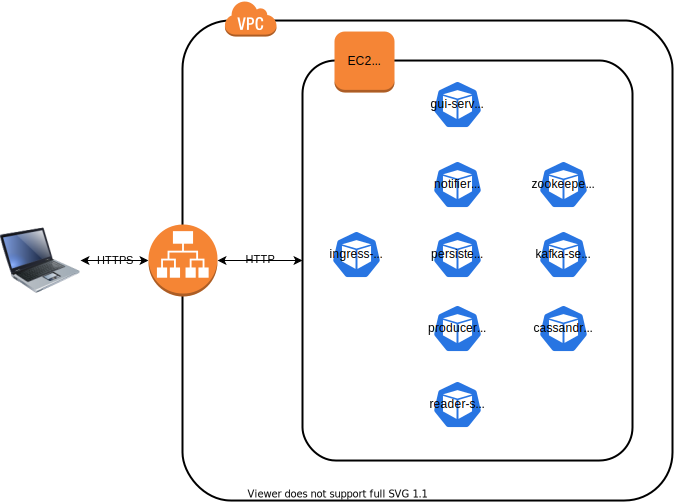

Event Sourcing CQRS Microservices application with SSE Web Push Notifications on top of Kubernetes with Kafka and Cassandra

Online: https://kafka-cqrs.alterbit.org

# Architecture

Single EC2 Demo Deployment



Once demo up and running, shows data flow between microservices and traffic details (CRUD + Push Notifications).


# Prerequisites

- Git
  ```
  $ git version
  git version 2.31.1
  ```

- Java
  ```
  $ java -version
  java version "11.0.1" 2018-10-16 LTS
  Java(TM) SE Runtime Environment 18.9 (build 11.0.1+13-LTS)
  Java HotSpot(TM) 64-Bit Server VM 18.9 (build 11.0.1+13-LTS, mixed mode)
  ```  

- Docker (client only)
  ```
  $ docker version
  Client:
   Version:           20.10.9
   API version:       1.41
   Go version:        go1.16.8
   Git commit:        c2ea9bc
   Built:             Sun Oct 10 22:41:14 2021
   OS/Arch:           linux/amd64
   Context:           default
   Experimental:      true
  ...  
  ```  

- Kubernetes
  ```
  $ minikube version
  minikube version: v1.23.2
  commit: 0a0ad764652082477c00d51d2475284b5d39ceed
  ```  

  ```
  $ kubectl version
  Client Version: version.Info{Major:"1", Minor:"22", GitVersion:"v1.22.2", GitCommit:"8b5a19147530eaac9476b0ab82980b4088bbc1b2", GitTreeState:"clean", BuildDate:"2021-09-15T21:38:50Z", GoVersion:"go1.16.8", Compiler:"gc", Platform:"linux/amd64"}
  ```  

- Node
  ```
  $ node --version
  v14.18.0
  ```  

  ```
  $ npm -version
  6.14.15
  ```

- Curl
  ```
  $ curl --version
  curl 7.76.1 (x86_64-redhat-linux-gnu) ...
  Release-Date: 2021-04-14
  ```

- Terraform
  ```
  $ terraform -v
  Terraform v1.0.0
  on linux_amd64
  ```


# Run Steps

## Start Minikube

- Start minikube

  `$ minikube start`

- Enable minikube promiscuous mode (minikube issue workaround)

  `$ minikube ssh sudo ip link set docker0 promisc on`

- Enable ingress

  `$ minikube addons enable ingress`


## Clone

  `$ git clone https://github.com/jojczykp/kafka-cqrs.git`

  `$ cd kafka-cqrs`


## Build

  - Before any docker operation, make sure switched to repository inside minikube
    
    `$ eval $(minikube docker-env)`
  
  - Build and upload image to docker repository
  
    `$ ./gradlew clean docker`
    
    First run may take longer as docker downloads base images.


## Start

  `$ kubectl -f deployment/kubernetes apply --recursive`

  `$ kubectl wait deployment --for=condition=available -l app=kafka-cqrs --timeout=600s`


## Test

  Mac: `$ minikube tunnel`

  Mac: `$ export API_GATEWAY=127.0.0.1`, Linux `$ export API_GATEWAY=$(minikube ip)`

  `$ ./gradlew e2e-tests:test --rerun-tasks`
  

## Try Web UI

  `$ open http://${API_GATEWAY}/gui/`
  
  Note that "Copy to Clipboard (📋)" button works only when accessing page via https or at localhost.


## Try CLI

- **CONSOLE 1** (listen to data change events):

  `$ curl -v http://${API_GATEWAY}/notifier/documents`

  Keep watching output...


- **CONSOLE 2** (create some data)

  `$ curl -v http://${API_GATEWAY}/producer/documents -H 'Content-Type: application/vnd.kafka-cqrs.create-document.1+json' -d '{"author":"Author1", "text":"Some Text"}'`


- **CONSOLE 3** (read persistent data)

  `$ curl -v http://${API_GATEWAY}/reader/documents/[document-id (payload.id) from CONSOLE1]`


## Develop UI

  `$ cd gui-service`
  
  `$ npm install`

  Mac: `$ minikube tunnel`

  Mac: `$ export API_GATEWAY=127.0.0.1`, Linux:`$ export API_GATEWAY=$(minikube ip)` 
  
  `$ npm start`
  
  Should take us to http://localhost:8080/


## Develop Backend

Until proper Java11 support is available in Cassandra libraries used, following needs to be added to Java commandline when running tests from IDE
(unfortunately my current IntelliJ version does not pick it from gradle automatically):

  `--add-exports java.base/jdk.internal.ref=ALL-UNNAMED`


## Shutdown

  `$ kubectl -f deployment/kubernetes delete --recursive`

  `$ kubectl wait deployment --for=delete -l app=kafka-cqrs`
  
  
## Cleanup
  
  `$ eval $(minikube docker-env)`

  `$ ./gradlew clean dockerRemoveImage`

  `$ minikube delete`


## Run in AWS EC2

  `$ cd deployment/environments/minikube-aws-ec2`

  `$ terraform init`

  `$ terraform apply`
  
  Above will take about 15 minutes and start EC2, clone, build and start application on it.
  
  Use command printed as terraform output to tail log from this process (use your aws key file), and URL to access GUI
  once up and running.

  In order to run e2e tests on newly created instance:

  ```
  $ export API_GATEWAY=<public_ip>
  $ ./gradlew e2e-tests:test --rerun-tasks
  ```

  To drop EC2:
  
  `$ terraform destroy`

------------

# Cheat sheet

`$ ./gradlew dockerRemoveImage`

`$ ./gradlew clean dockerBuildImage`

`$ kubectl get ingress kafka-cqrs-ingress`

`$ minikube start && minikube ssh sudo ip link set docker0 promisc on`

`$ minikube ssh`

`$ minikube dashboard`

`$ curl http://$(minikube ip)/debugger`

`$ kubectl exec -it $(kubectl get pods -o name -l service=debugger-service | cut -d'/' -f2) sh`

`$ kubectl exec -it $(kubectl get pods -o name -l service=kafka-service | cut -d'/' -f2) bash`

`# kafka-console-producer.sh --broker-list kafka-service:9092 --topic documents.t`

`# kafka-console-consumer.sh --bootstrap-server kafka-service:9092 --topic documents.t`

`$ kubectl logs -f $(kubectl get pods -o name -l service=kafka-service | cut -d'/' -f2)`

`$ kubectl -n kube-system logs -f $(kubectl -n kube-system get pods -o name -l app=nginx-ingress-controller | cut -d'/' -f2)`

`$ kubectl exec -it $(kubectl get pods -o name | grep kafka-cqrs-zookeeper-service | cut -d'/' -f2) zkCli.sh`

`$ kubectl exec -it $(kubectl get pods -o name | grep kafka-cqrs-cassandra-service | cut -d'/' -f2) cqlsh`

`> select * from documents.documents;`

```
test {
    jvmArgs '--add-exports', 'java.base/jdk.internal.ref=ALL-UNNAMED'
    logging.captureStandardOutput LogLevel.DEBUG
}
```


# TODOs
- Store recent offset on client side (i.e. in cookies), so that it can continue after interruption without loosing messages
- Upgrade Cassandra to version supporting Java 11/17
- Upgrade other elements so that no Java 11/17 TODOs left
- HTTP/2 Support


# References
- https://thenewstack.io/kubernetes-deployments-work/
- https://github.com/infrabricks/kubernetes-standalone
- https://dzone.com/articles/getting-started-with-spring-data-cassandra
- https://medium.freecodecamp.org/part-1-react-app-from-scratch-using-webpack-4-562b1d231e75
- https://medium.com/@andyccs/webpack-and-docker-for-development-and-deployment-ae0e73243db4
