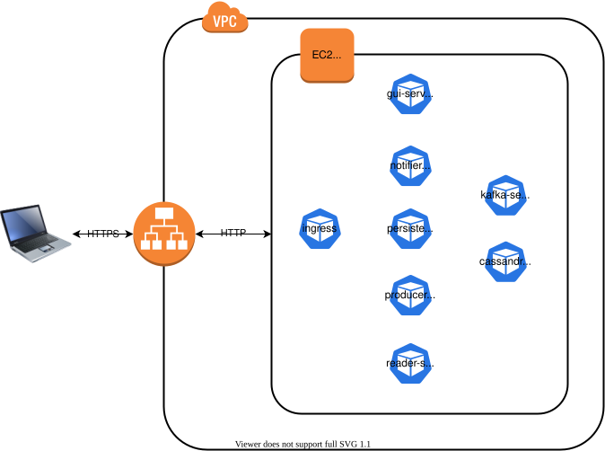
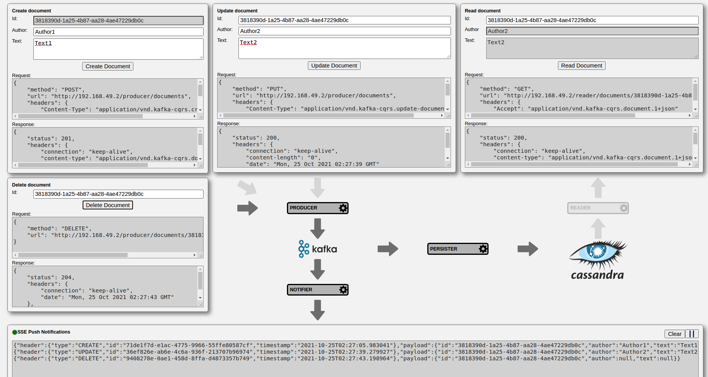

Event Sourcing CQRS Microservices application with SSE Web Push Notifications on top of Kubernetes with Kafka and Cassandra

Online: https://kafka-cqrs.alterbit.org

# Architecture

Single EC2 Demo Deployment



Once demo up and running, shows data flow between microservices and traffic details (CRUD + Push Notifications).




# Prerequisites

- Git
  ```shell
  git version
  ```
  ```
  git version 2.52.0
  ```

- Java
  ```shell
  java -version
  ```
  ```
  openjdk version "21" 2023-09-19
  OpenJDK Runtime Environment (build 21+35-2513)
  OpenJDK 64-Bit Server VM (build 21+35-2513, mixed mode, sharing)
  ```  

- Docker (client only)
  ```shell
  docker version
  ```
  ```
  Client:
   Version:           29.1.3
   API version:       1.52
   Go version:        go1.25.5
   Git commit:        f52814d
   Built:             Fri Dec 12 14:48:46 2025
   OS/Arch:           darwin/arm64
   Context:           default
  ...  
  ```  

- Kubernetes
  ```shell
  minikube version
  ```
  ```
  minikube version: v1.37.0
  commit: 65318f4cfff9c12cc87ec9eb8f4cdd57b25047f3
  ```  

  ```shell
  kubectl version
  ```
  ```
  Client Version: v1.35.0
  Kustomize Version: v5.7.1
  ...
  ```  

- Node
  ```shell
  node --version
  ```
  ```
  v25.2.1
  ```  

  ```shell
  npm -version
  ```
  ```
  11.7.0
  ```

- Curl
  ```shell
  curl --version
  ```
  ```
  curl 8.7.1 ...
  ...
  ```

- Terraform
  ```shell
  terraform -v
  ```
  ```
  Terraform v1.14.0
  on darwin_arm64
  ```


# Run Steps

## Start Minikube

- Start minikube
  ```shell
  minikube start
  ```

- Enable ingress

  ```shell
  minikube addons enable ingress
  ```


## Clone

  ```shell
  git clone https://github.com/jojczykp/kafka-cqrs.git
  ```

  ```shell
  cd kafka-cqrs
  ```


## Build

  - Make sure talking to local docker daemon, NOT one in minikube
    
    ```shell
    eval $(minikube docker-env -u)
    ```
  
  - Build and run tests
  
    ```shell
    ./gradlew clean test
    ````
    
## Start

  ```shell
  eval $(minikube docker-env)
  ```

  ```shell
  ./gradlew buildDockerImage
  ````

  First run may take longer as docker downloads base images.

  ```shell
  kubectl -f deployment/kubernetes apply --recursive
  ```

  ```shell
  kubectl wait deployment --for=condition=available -l app=kafka-cqrs --timeout=600s
  ```


## Test

**Terminal 1:**

  ```shell
  kubectl -n ingress-nginx port-forward service/ingress-nginx-controller 8080:80 # Mac (separate console)
  ```

**Terminal 2:**

  ```shell
  export API_GATEWAY=127.0.0.1:8080 # Mac
  ```
  ```shell
  export API_GATEWAY=$(minikube ip) # Linux
  ```

  ```shell
  ./gradlew e2eTest --rerun-tasks
  ```
  

## Try Web UI

  ```shell
  open http://${API_GATEWAY}/gui/
  ```
  
## Try CLI

- **CONSOLE 1** (listen to data change events):

  ```shell
  curl -v http://${API_GATEWAY}/notifier/documents
  ```

  Keep watching output...


- **CONSOLE 2** (create some data)

  ```shell
  curl -v http://${API_GATEWAY}/producer/documents -H 'Content-Type: application/vnd.kafka-cqrs.create-document.1+json' -d '{"author":"Author1", "text":"Some Text"}'
  ```


- **CONSOLE 3** (read persistent data)

  ```shell
  curl -v http://${API_GATEWAY}/reader/documents/[document-id (payload.id) from CONSOLE1]
  ```


## Develop UI

  ```shell
  cd gui-service
  ```
  
  ```shell
  npm install
  ```

  ```shell
  kubectl -n ingress-nginx port-forward service/ingress-nginx-controller 8080:80 # Mac (separate console)
  ```

  ```shell
  export API_GATEWAY=127.0.0.1:8080 # Mac
  ```

  ```shell
  export API_GATEWAY=$(minikube ip) # Linux
  ``` 
  
  ```shell
  npm start
  ```
  
  Should take us to http://localhost:8080/


## Shutdown

  ```shell
  kubectl -f deployment/kubernetes delete --recursive
  ```

  ```shell
  kubectl wait deployment --for=delete -l app=kafka-cqrs
  ```
  
  
## Cleanup
  
  ```shell
  eval $(minikube docker-env)
  ```

  ```shell
  ./gradlew clean removeDockerImage
  ```

  ```shell
  minikube delete
  ```


## Run App in AWS EC2

  ```shell
  cd deployment/environments/aws-ec2-minikube/blue
  ```

  ```shell
  terraform init
  ```

  ```shell
  terraform apply
  ```
  
  Above will take about 15 minutes and start EC2, clone, build and start application on it.
  
  Use command printed as terraform output to tail log from this process (use your aws key file), and URL to access GUI
  once up and running.

  In order to run e2e tests on newly created instance:

  ```shell
  export API_GATEWAY=<public_ip>
  ```

  ```shell
  ./gradlew e2e-tests:test --rerun-tasks
  ```

  To drop EC2:
  
  ```shell
  terraform destroy
  ```


## Run TLS Proxy in AWS EC2

This is for SSL/TLS termination and bases on https://letsencrypt.org.

  To be prepared before:

  A domain that you want to use for an application and control
  (can edit IP it points to).

  To Create Proxy:

  ```shell
  cd deployment/environments/aws-ec2-tls-proxy
  ```

  ```shell
  DOMAIN=<domain-you-control-and-want-to-see-app-behind>
  EMAIL=<email-lets-encrypt-require>
  TARGET_IP=<ip-to-forward-to-where-app-is-running>
  ```

  ```shell
  terraform apply -var domain=${DOMAIN} -var email=${EMAIL} -var target_ip=${TARGET_IP}
  ```

  To Drop Proxy:

  ```shell
  terraform destroy -var domain=${DOMAIN} -var email=${EMAIL} -var target_ip=${TARGET_IP}
  ```

------------

# Cheat sheet

  ```shell
  ./gradlew removeDockerImage
  ```

  ```shell
  ./gradlew clean test docker
  ```

  ```shell
  kubectl get ingress kafka-cqrs-ingress
  ```

  ```shell
  minikube ssh
  ```

  ```shell
  minikube dashboard
  ```

  ```shell
  curl http://$(minikube ip)/debugger
  ```

  ```shell
  kubectl exec -it $(kubectl get pods -l service=debugger-service -o jsonpath='{.items[0].metadata.name}') -- sh
  ```

  ```shell
  kubectl exec -it $(kubectl get pods -l service=kafka-service -o jsonpath='{.items[0].metadata.name}') -- bash
  ```

  ```shell
  /opt/kafka/bin/kafka-console-consumer.sh --bootstrap-server kafka-service:9092 --topic documents.t
  ```

  ```shell
  /opt/kafka/bin/kafka-console-producer.sh --broker-list kafka-service:9092 --topic documents.t
  ```

  ```shell
  kubectl logs -f svc/kafka-service
  ```

  ```shell
  kubectl -n ingress-nginx logs -l app.kubernetes.io/component=controller -f
  ```

  ```shell
  kubectl exec -it $(kubectl get pods -l service=cassandra-service -o jsonpath='{.items[0].metadata.name}') -- cqlsh
  select * from documents.documents;
  ```

  ```shell
  while true ; do kubectl -n ingress-nginx port-forward service/ingress-nginx-controller 8080:80 ; sleep 1 ; done
  ```

  ```shell
  minikube delete && minikube start && minikube addons enable ingress && eval $(minikube docker-env) && ./gradlew buildDockerImage && kubectl -f deployment/kubernetes apply --recursive && kubectl wait deployment --for=condition=available -l app=kafka-cqrs --timeout=600s && export API_GATEWAY=127.0.0.1:8080 && ./gradlew e2eTest --rerun-tasks && open "http://${API_GATEWAY}"
  ```

# TODOs
- Upgrade to Jackson 3.x when possible (when Spring is compatible) to avoid deprecation warnings
- Store recent offset on client side (i.e. in cookies), so that it can continue after interruption without loosing messages
- Distroless images


# References
- https://thenewstack.io/kubernetes-deployments-work/
- https://github.com/infrabricks/kubernetes-standalone
- https://dzone.com/articles/getting-started-with-spring-data-cassandra
- https://medium.freecodecamp.org/part-1-react-app-from-scratch-using-webpack-4-562b1d231e75
- https://medium.com/@andyccs/webpack-and-docker-for-development-and-deployment-ae0e73243db4
