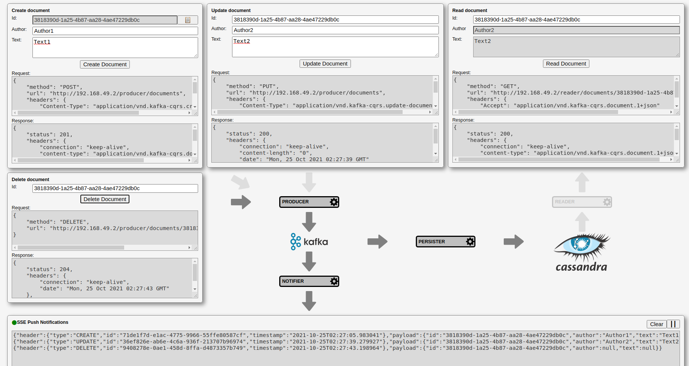

Event Sourcing CQRS Microservices application with SSE Web Push Notifications on top of Kubernetes with Kafka and Cassandra

# Architecture

Once demo up and running, shows data flow between microservices and traffic details (CRUD + Push Notifications).



# Prerequisites
- JDK 11
- Kubernetes (https://kubernetes.io/)
- Minikube (with dns and ingress enabled, I used v1.13.9)
- Docker (https://www.docker.com/ - no need for daemon, just client to connect to server in minikube, build image)

- npm 6.14.4
- nodejs 12.16.3


# TODOs
- Turn demo Web-UI into service
- EKS deployment
- Upgrade Cassandra to version supporting Java 11
- Upgrade other elements so that no Java 11 TODOs left


# References
- https://thenewstack.io/kubernetes-deployments-work/
- https://github.com/infrabricks/kubernetes-standalone
- https://dzone.com/articles/getting-started-with-spring-data-cassandra


# Run Steps

## Build Cassandra with JDK11 support

  Step to be removed once official release supporting JDK 11 is available.

  Have maven and ant installed. Then clone, build and install `cassandra-all` in local maven repo:
  
  `$ git clone https://github.com/jojczykp/cassandra.git --single-branch --branch missing-hppc-transitive-dependency-in-produced-pom`
  
  `$ cd cassandra`
  
  `$ ant mvn-install`


## Start Minikube

- Make sure minikube VM has enough resources (I used 3 CPU cores, 12GB RAM)

- Start minikube

  `$ minikube start --cups=3 --memory=12288`

- Enable ingress

  `$ minikube addons enable ingress`

- Enable minikube promiscuous mode (minikube issue workaround):

  `$ minikube ssh sudo ip link set docker0 promisc on`


## Build

  Make sure application is down if was already running.
  
  - Before any docker operation, make sure switched to repository inside of minikube
    
    `$ eval $(minikube docker-env)`
  
  - Build and upload image to docker repository
  
    `$ ./gradlew clean dockerBuildImage`


## Deploy

    `$ kubectl -f e2e-tests/kubernetes apply --recursive`

    `$ kubectl wait deployment --for=condition=available -l app=kafka-cqrs`


## Run Demo

  `$ cd web-ui`
  
  `$ npm install`
  
  `$ export API_GATEWAY=$(minikube ip)`
  
  `$ npm start`
  
  Should take us to http://localhost:8080/


## E2E Tests


### Automated

  `$ export API_GATEWAY=$(minikube ip)`

  `$ ./gradlew e2e-tests:test --rerun-tasks`
  
  
### Manual

- **CONSOLE 1** (listen to data change events):

  `$ curl -v http://$(minikube ip)/notifier/documents`

  Keep watching output...


- **CONSOLE 2** (create some data)

  `$ curl -v http://$(minikube ip)/producer/documents -H 'Content-Type: application/vnd.kafka-cqrs.create-document.1+json' -d '{"author":"Author1", "text":"Some Text"}'`


- **CONSOLE 3** (read persistent data)

  `$ curl -v http://$(minikube ip)/reader/documents/[document-id from CONSOLE1]`


## Shutdown

  `kubectl -f e2e-tests/kubernetes delete --recursive`

  `kubectl wait deployment --for=delete -l app=kafka-cqrs`
  
  
## Cleanup
  
  `$ eval $(minikube docker-env)`

  `$ ./gradlew clean dockerRemoveImage`

  `$ minikube delete`

------------

# Other useful commands

`$ ./gradlew dockerRemoveImage`

`$ ./gradlew clean dockerBuildImage`

`$ kubectl -f e2e-tests/kubernetes apply`

`$ kubectl get ingress kafka-cqrs-ingress`

`$ minikube ssh`

`$ minikube dashboard`

`$ curl http://${API_GATEWAY}/debugger`

`$ kubectl exec -it $(kubectl get pods -o name -l service=debugger-service | cut -d'/' -f2) sh`

`$ kubectl exec -it $(kubectl get pods -o name -l service=kafka-service | cut -d'/' -f2) bash`

`# kafka-console-producer.sh --broker-list kafka-service:9092 --topic documents.t`

`# kafka-console-consumer.sh --bootstrap-server kafka-service:9092 --topic documents.t`

`$ kubectl logs -f $(kubectl get pods -o name -l service=kafka-service | cut -d'/' -f2)`

`$ kubectl -n kube-system logs -f $(kubectl -n kube-system get pods -o name -l app=nginx-ingress-controller | cut -d'/' -f2)`

`$ kubectl exec -it $(kubectl get pods -o name | grep kafka-cqrs-zookeeper-service | cut -d'/' -f2) zkCli.sh`

`$ kubectl exec -it $(kubectl get pods -o name | grep kafka-cqrs-cassandra-service | cut -d'/' -f2) cqlsh`

`> select * from documents.documents;`

```
test {
    jvmArgs '--add-exports', 'java.base/jdk.internal.ref=ALL-UNNAMED'
    logging.captureStandardOutput LogLevel.DEBUG
}
```

# Links
- https://medium.freecodecamp.org/part-1-react-app-from-scratch-using-webpack-4-562b1d231e75
